# 北七10年新家庭

## 自我介紹

### 山家 - 小咩家

 - `小羊咩` - 育
 - `小雪狐` - 蜂二

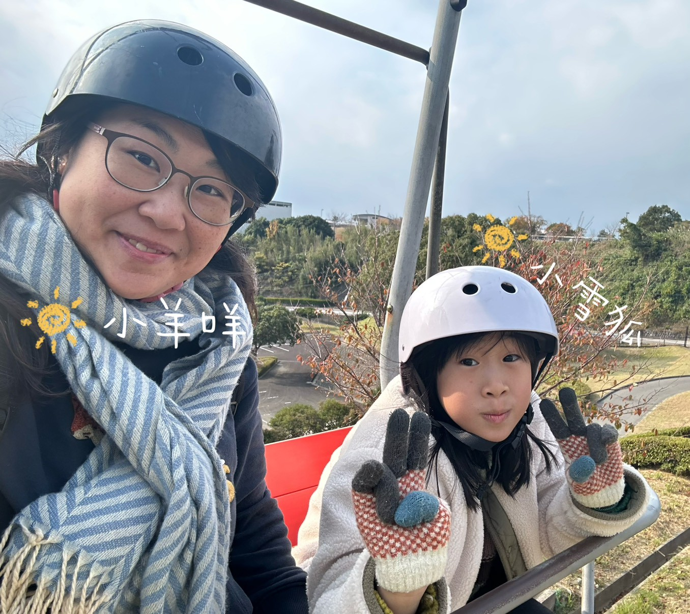

```
大家晚安!

我們是新加入的「小羊咩」、「小雪狐」 母女檔，很開心能加入北七團，期待跟大家一起玩😍

/參加北七團的起源於/

渴望與大自然多一些互動接觸。

小羊咩(就是我)小時侯，假日時常跟有植樹夢的爸爸在鹿野某個原始山林裡到處走、查看水線、溯溪、砍藤蔓。雖然都沒有認真的把大自然裡看到的一草一木、一昆蟲一動物的學名們都學起來，但從小觸摸石頭上的青苔、觀看夜間紛飛的蛾群、伺機而動的小動物都深深吸引我的目光和端詳大自然帶來的美感、神秘與寧靜。

如今，居住在大城市，即便孩子幼稚園階段玩的很野、很瘋，但隨著小雪狐年紀的增長，生活視角大多以學校為導向，親近大自然的機會越來越少，也鮮少感受大自然裡單純的美好；希望藉著這個的機會，跟大家一起親近大自然、學習、交流、開拓新視野。

/介紹我們的自然名、個性、興趣專長/

小雪狐-今年過完暑假升小四的女孩

小雪狐說她喜歡狐狸，因為她剛好很喜歡狡猾的動物，加上名字裡有個”白”，所以取名小雪狐。

小雪狐的興趣是跑步、摺紙、手作DIY、跳啦啦隊。個性慢熱(一開始比較臭臉會需要一點時間)、喜歡思考和知識學習、擅長解決問題、很有自己的主見，喜歡參加戶外探索活動，像是水上活動或攀樹、定向、騎腳踏車……等。

小羊咩-小雪狐的阿母

自然名原本要歡天喜地的取一個新名字，但後來想想本來的綽號”小咩”就是自然名了，詢問了小雪狐的意見稍作更改，叫小羊咩，跟她同姓、同字量；彰顯我們是一家人。

我的興趣是”觀察”，觀察身周邊人事時地物的各種變化，喜歡探索新奇有趣的事物，喜歡繪本，喜歡故事，喜歡音樂；喜歡親近大海，泡在水裡；喜歡走步道，觀察步道上的小生態。

我的專長是……跟小孩玩(特別是瞎搞的部分、練瘋話的部分)，大學期間都在帶不同的兒童營隊、兒童志工，也因為工作的關係15年來時常跟各式各樣不同性格的孩子在一起，陪伴他們的情緒&人際議題，欣賞孩子和繪本帶領是我很喜歡做也和擅長做的事情。不過可能也因為一直都跟孩子待在一起，所以個性有點ㄎㄧㄤˉ，連我女兒都有點受不了我XD

以上報告完畢!謝謝大家!
```

### 山家 - 微薫家

 - `薰衣草` - 育
 - `微風` - 育
 - `大白鯊` - 鹿二

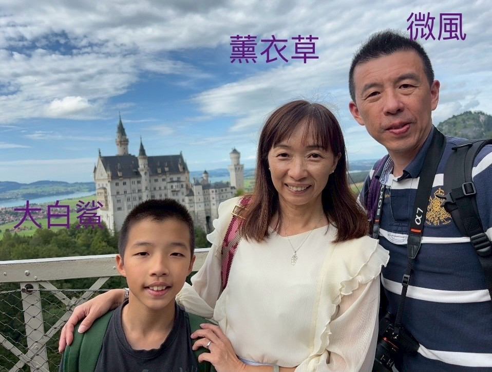

```
很開心能夠加入北七大家庭，得知我們家可以加入時，我們超開心的！覺得我們全家三人共同為一件事情努力，並得到成果的感覺真好。

兒子今年暑假後升國一，會念濱江實驗中學。為了取自然名他想了很多可能，因為他國小是游泳校隊，我提議可以叫海豚，他覺得不夠帥，於是他想到大白鯊，他覺得比較帥。

我及先生的自然名都跟別人重複，所以重取。我現在取薰衣草，因為我喜歡花，我努力想我喜歡的紫色有什麼花，想到薰衣草，我喜歡他的味道及安定人心的功能，也是我嚮往的境界。

先生取名微風，因為他的名字最後一個字有同音的維。

我們家共同興趣是一起出去玩，露營，出國自助旅行。

兒子的興趣還蠻廣泛，動靜皆有，游泳、攀岩、很喜歡自然科學，喜歡做實驗，參加過四次的木工夏令營，組裝類也很喜歡。

期待入團之後，我們全家可以同心協力完成很多事情，跟不同的家庭互動、互相學習、成長。兒子及家長都得到成長所需要的滋養跟喜悅，也從付出中學習承擔力。
```

### 山家 - 恆星家

 - `恆星` - 育
 - `天狼星` - 育
 - `天王星` - 蟻三

!!! note

    `黛西` 已改名爲 `恆星`

    `路易吉` 已改名爲 `天狼星`

    `瑪利歐` 已改名爲 `天王星`


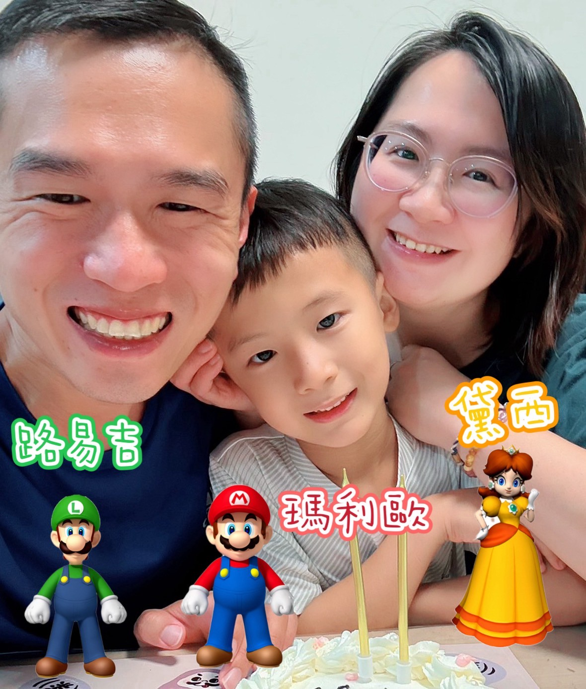

```
Hi 大家好～～

很高興有機會全家一起加入北七這個大家庭(蟻團)(moon grin)

看大家自我介紹都寫的好豐富，實在是不知道該怎麼介紹很普通的我們😂

▪︎家庭自然名的由來？

爸爸：太陽花🌻

很莫名其妙的自然名😂

爸爸本來想叫太陽，但發現有重複只好另外想，後來想到有時候跟老公murmur好久沒有收過花，他就會比自己說：「送妳一朵太陽花啊！」乾脆就讓他當太陽花😆

媽媽：天人菊🌼

本來想說老公當太陽我就要當彩虹，但後來老公變成花卉，所以我就想到我們很喜歡的澎湖島花是可愛的天人菊🌼那就以澎湖的島花來當作自己的自然名，也呼應老公成為花卉一族

兒子：怪傑佐羅力

準備升小二的兒子，因為最近愛上佐羅力套書，乾脆拿來當自己的自然名😆個性有點悶騷慢熟，到新環境習慣先默默在旁邊觀察，熟了之後就會變high變活潑調皮(淘氣)喜歡跟朋友玩、騎車、攀爬、溜索(順便推薦花蓮野猴子)，偶爾會跟爸爸一起參加親子鐵或斯巴達活動。目前最喜歡的角色是奧特曼，書籍則是佐羅力系列，也很喜歡聽podcast講故事（猴子警長、豬探長、童話阿姨）

【家庭的興趣與親子活動】

我們放假很少待在家，喜歡跟朋友約一起遛小孩😆可能約公園玩、騎車、打球、去山上露營，或是找小孩有興趣的活動參加(謝謝)夏天喜歡去玩水，泳池、溪邊、海邊都喜歡。

```

```
大家哈囉～

我們是原本的佐羅力家，後來改為瑪利歐家😆

其實之前一直為了自然名很煩惱，前面的太陽花、天人菊、佐羅力也是很突然的想到的，但覺得我們夫妻跟孩子沒什麼關聯😂（我們也不想叫佐羅力的夥伴-伊豬豬&魯豬豬😛）

後來是某天看到有夥伴（遊戲家）提到瑪利歐裡面的角色耀西，突然想到～對耶兒子也很愛瑪利歐!!於是乎～～我們家又針對自然名討論了一下（感謝還能更改(heart)）

最後決定兒子選他最喜歡的角色瑪利歐、爸爸則當他的好夥伴/好兄弟路易吉，媽媽就當路易吉的搭檔黛西！三個人一起跟打瑪利歐遊戲一樣，在成長的道路上一起遊戲、闖關、打怪、看世界(moon grin)
```

### 山家 - 森林之家

 - `晨光` - 育
 - `阿勃勒` - 育
 - `龍捲風` - 鹿二

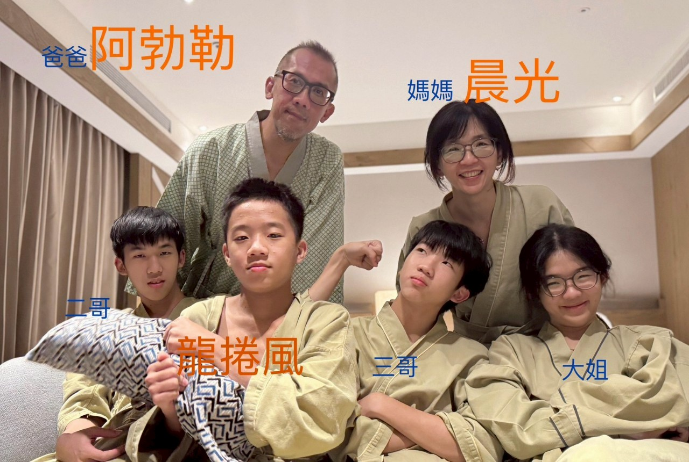

```
大家好，我們家是今年新進家庭

▪︎家庭自然名的由來？（為什麼取這個自然名？)

爸爸：阿勃勒

爸爸跟媽媽在想自然名的時候，心有靈犀的都選了晨光，但是後來媽媽選擇了彩虹，之後被告知已經有人使用這個名字，所以爸爸把晨光的名字讓給媽媽，而他選了這個名字「阿勃勒」。

原因是因為年紀已經是阿伯，所以大家看到他就是「阿伯了」😝！但媽媽覺得這個名字可以看作快樂的阿伯🧍‍♂️⋯⋯阿伯「樂」❤️！

兒子：龍捲風

去年去新竹天人岩屋時，兒子選了這個名字，但現在他已經忘記為何當初選了這個名字😧😝😂

媽媽：晨光

我們家是基督信仰家庭。「祂出現確如晨光。」是聖經中很美的一句話。自己也特別喜歡早晨照入家中的陽光，不是因為我做了什麼，卻能被它溫暖照亮。也想期許並提醒自己，當媽媽妻子能像晨光一樣，安靜有溫柔力量。（期許自己中……）

▪︎家庭成員？

我們有四個孩子，一女三男，分別為20、19、17、12歲。

大哥哥大姐姐目前都在國內外大學就讀，老三在台灣唸高中，這次加入只有最小的老四龍捲風加入荒野。

▪︎本身的興趣專長？

爸爸從事投資工作，所以專長是投資，曾在自學團體中教授孩子們理財投資課程。興趣：打籃球、登山、閱讀。

媽媽目前在英語自學團體擔任課程老師、以及在教會擔任聖經查經老師，對象是國小至成人，所以專長是教學和說故事。

興趣是吃美食、睡覺💤（怎麼覺得有點像豬🐷)

▪︎孩子的個性與興趣（喜歡什麼、個性特點）

個性穩定、很容易和人交流、不怕生，願意服務別人，有責任感。

喜歡小貓貓🐱小狗🐶喜歡建築🏠，

、看冒險小說、各樣運動與桌球，有很不錯的體能。

▪︎平常最喜歡的親子活動

因為孩子多，前三個孩子也大了，現在能全員到齊的機會跟時間不多，如果有機會，會一起家庭旅遊。以前孩子還小的時候，我們會一起去爬山、健行，或是在家中玩桌遊、下西洋棋，或是一起做東西吃吃喝喝。

▪︎想讓大家知道的小提醒或家庭小故事：

我們的家庭是自學家庭，從第一個孩子開始到現在已經自學了10年，今年進入第11年，所以在陪伴孩子成長的過程中，我們有多一些機會和時間，可以一起完成孩子想完成的計劃。

所以老大、老二跟老四都分別在他們12歲的時候，在父母和手足的分別陪伴下，完成了他們給自己的12歲生日禮物：徒步環島的計劃。

老三則是學習手造獨木舟，之後在台灣可以下水的海岸，和夥伴在老師的指導下下水划舟。

因為前面三個孩子年齡比較相近，所以過去我們在家裡就有很多的活動可以一起進行。過去對荒野有一些了解，但是始終沒有機會加入。現在最小的孩子進入青春期，我們也希望為他能夠預備一個可以一起成長學習的環境，有機會可以認識一群可以一起犯錯、學習、勇敢的伙伴，我們一家很多需要學習的，也請大家多多指教。
```

### 山家 - 米蝦家

 - `薑片` - 育
 - `米蝦` - 育
 - `山葵` - 鹿一
 - `芒果` - 蜂一
 - `劍齒虎` - 蟻一

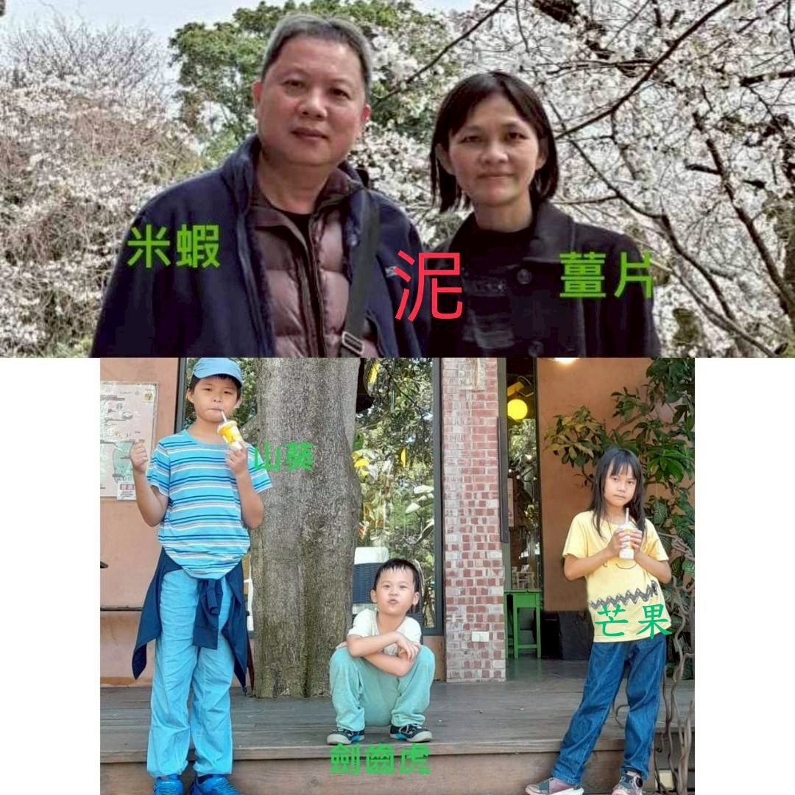

!!! note

    `茶碗蒸` 已改名爲 `芒果`

```
大家好，我們是兩大三小的新團員，三個孩子分別是小六、小二和中班，很開心加入北七蟻團、蜂團和鹿團，和大家一起在自然中學習成長。

關於我們:

爸爸取名“米蝦”，因為最近迷上養米蝦，覺得佈置魚缸及觀察蝦子活動、進食的動作很舒壓，三個孩子也喜歡觀察魚蝦，偶爾幫忙餵食、整理魚缸。米蝦個性誠懇，做事謹慎，喜歡拆解維修機械，家中玩具、家電壞了都難不倒他。

媽媽取名“薑片”源於寒涼的體質，最愛各種加薑料理。喜歡觀察動植物（除了蟑螂...），嚮往戶外自然活動，自知個性有點懶，缺少動力時假日會不自覺在家躺平，很開心加入北七，期待動力滿滿，和夥伴們一起陪伴孩子上山下海。

老大哥哥“山葵（wasabi）”，11歲，喜歡有點無厘頭的搞怪，能加入“北七”真的太合他的心意，這次取自然名“山葵”，本人表示：因為山葵很辣，是我害怕的食物。山葵是悶騷型，上台面對很多人的目光時會有些害羞。喜歡看書、桌遊、獨輪車和嘗試各種運動。

老二妹妹“茶碗蒸”8歲，前陣子和哥哥挑戰做茶碗蒸，現在是她心目中前幾名的美食。她個性和善，喜歡交朋友，但在新團體中需要觀察熱機一下。體貼的茶碗蒸在家中是貼心的小幫手，出門玩時也很願意陪伴年紀小的孩子。喜歡畫畫、勞作、扯鈴、獨輪車。

老三弟弟劍齒虎5歲，今年加入蟻團，是愛撒嬌的老么，不管哥哥姐姐做什麼都想湊一腳。喜歡交朋友，最近有英雄崇拜傾向，對“厲害的角色”情有獨鍾，就連拍照時也喜歡擺出自認酷炫的表情姿勢。

假日時喜歡全家騎自行車追風，去年陪伴山葵和茶碗蒸獨輪車路騎訓練時，一路上都有自行車騎士為他們加油，是很溫暖又特別的經驗。

最後，期待在北七團和大家開心共學、共遊呦！
```

### 山家 - 馬達家

 - `馬達加斯加` - 育
 - `台灣黑熊` - 育
 - `小爪水獺` - 蟻一

!!! note

    `馬達` 已改名爲 `馬達加斯加`


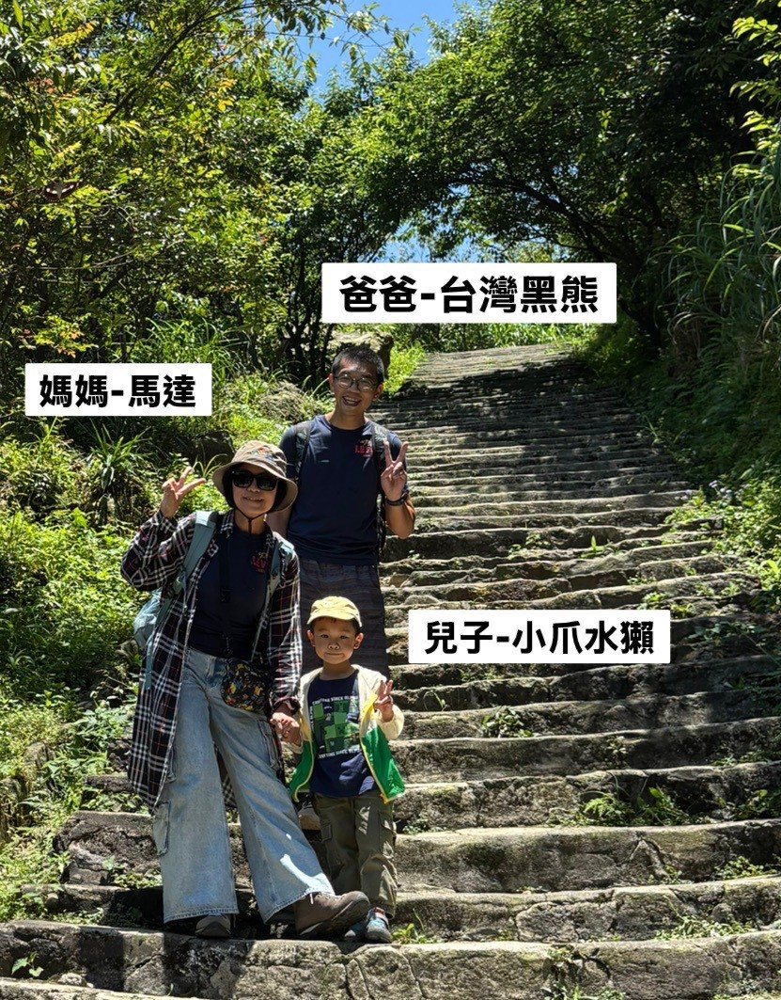

```
大家好！

我們是一個熱愛自然、喜歡探索的小家庭，這次很開心能加入荒野行列，期待和大家一起認識更多自然、發現生活裡的驚喜！

來介紹一下我們家的成員：

爸爸——台灣黑熊

就是我啦！因為皮膚曬得黝黑，又很愛台灣，所以選了台灣特有的台灣黑熊做自然名，希望自己能像黑熊一樣壯碩有力，成為家裡最可靠的靠山。我平常的興趣是籃球和健身，有空最喜歡到球場流汗，或是做一些重量訓練。家裡我負責說故事和體力活，無論是陪小孩追逐奔跑、搬東西，還是睡前來一段冒險故事，都是我的拿手好戲！

兒子（即將5歲）——小爪水獺

我們家最可愛、最會玩的寶貝，個性活潑愛聊天偶爾會有點矜持，超級喜歡玩水，看到水池、溪流、甚至水龍頭，都能玩得不亦樂乎。喜歡觀察動物和撿石頭，常常把口袋裝滿「寶藏」帶回家。他的自然名是小爪水獺，因為他就像水獺一樣靈巧、好奇又惹人疼愛撒嬌。

媽媽——馬達

我們家的行動發電機，靈感來自「馬達加斯加」，就像那片自然又充滿驚喜的土地一樣，溫柔又能幹，總是為家裡帶來源源不絕的活力與驚喜。媽媽在國泰人壽服務20年，保險實戰專知無敵。平常的興趣是烹飪和爬山，日常居多都是自己煮，在忙碌中還能快手出一桌好菜（自己老婆要自己誇）；喜歡挑戰登山步道，用雙腳征服風景，也讓家人一起擁抱大自然。在家裡，馬達負責美食和行程規劃，只要她出手，旅程和餐桌都絕對精彩！

我們家超喜歡到戶外散步、親近自然，也喜歡探索各種好吃、好玩的地方。加入荒野後，希望能和大家一起學習自然知識、享受親子時光、認識更多熱血夥伴！

期待很快能在活動裡遇見大家，一起聊天、運動、登山、玩水、享美食！
```

### 林家 - 儒艮家

 - `儒艮` - 育
 - `小海牛` - 蜂一

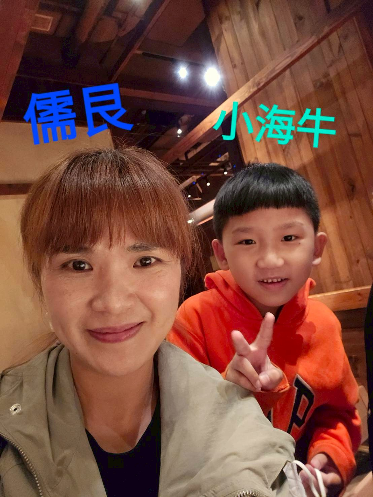

```
大家好～我們是儒艮和小海牛

自然名來自我們喜歡的大海，也希望自己能像儒艮和海牛一樣溫和、自在地生活在自然裡。

我們是一對懶懶的母子組合，平常很宅，不太愛出門，但這次鼓起勇氣加入親子團，希望可以多接觸大自然、多流汗、多交朋友

小海牛是一個害羞慢熟的小男生，但只要氣氛對了就會立刻人來瘋，喜歡拼積木、看書、想東想西，有時安靜、有時超吵，模式切換非常自由。

媽媽儒艮則是個熱愛放空和廢躺的人（但真的想變得比較健康一點啦）

很期待和大家一起冒險、一起曬太陽～

請多多指教！
```

### 林家 - 咩～攏吼tī 家

 - `北極星` - 育
 - `地瓜` - 育
 - `WINTER` - 鹿三
 - `白蘿蔔` - 蜂一

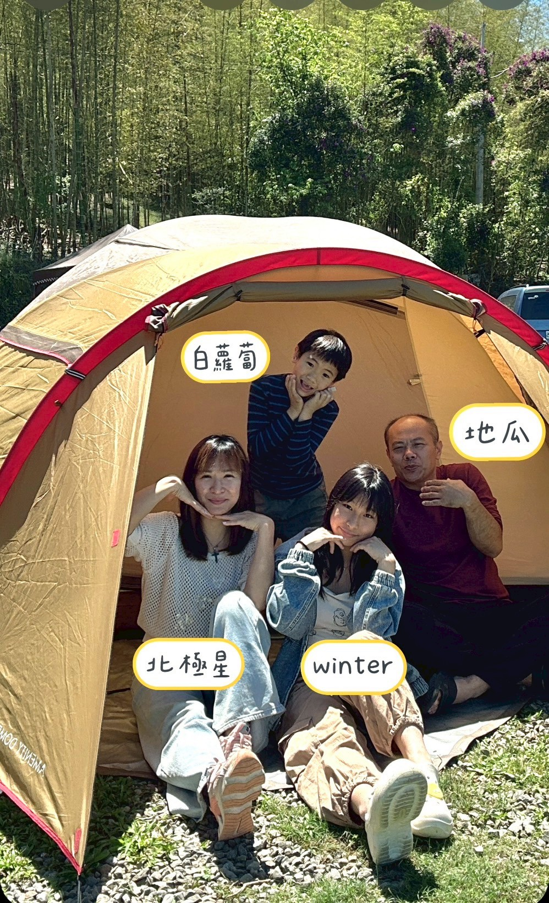

```
大家好，我們是二大二小的新家庭

(smile)

爸爸自然名:地瓜

本名是高銘謙(台語諧音:地瓜籤) 個性慢熟型人格，就像地瓜需要時間烘烤才會熟透，剛認識時比較靦腆、不多話，但熟了之後就很親切，喜歡泡茶。

(Sally wow)

媽媽自然名:北極星

一閃一閃亮晶晶，滿天星空，我就是最亮的那一顆，在導航系統還沒出現前，可是古人版的 Google Map

當了12年的全職媽媽，練就一點點廚藝，喜歡大自然，望山看海，拍影片、剪影片紀錄生活

(Sally wow)

姐姐(升國二) 自然名:winter

四季中最愛冬天，正值追星的年紀，剛好喜歡的明星之一也叫winter，自然名就這樣產出

青少女心思細膩、敏感、貼心、愛吃不挑食

興趣是彈鋼琴、烏克麗麗、跳舞、空中瑜伽

(Sally wow)

弟弟(升小三) 自然名:白蘿蔔

為了玩不重吃也不重睡！任何玩的機會，都不放過，從小就是用生命在玩樂(laugh Moon)，參與戶外活動，卻是全家唯一曬不黑的，小時後小名叫波波，因此取同音 白蘿蔔 

喜歡玩桌遊、看書、畫畫、彈鋼琴，個性活潑，但初期不熟的時後非常的內向慢熟，反差很大。 

大家如果有看過火神的眼淚，應該不陌生，那是我家爸爸的職業，也是我們家的日常，因為工作需要輪班，所以任何全家人能在一塊的時光，對我們而言都是最好的親子時間，，姐姐在小六以前在家自學，在那之前我們平日參與共學、小旅行、露營、夏天去海邊、冬天泡野溪溫泉，隨著國中課業繁忙，時間配比也不同了！很期待能在北七團，展開另一階段的探險。
```

### 林家 - 恩典家

 - `星空` - 育
 - `磐石` - 育
 - `山貓` - 鹿一
 - `老鷹` - 蟻三

!!! note

    `南洋大兜蟲` 已改名爲 `山貓`

    `長戢大兜蟲` 已改名爲 `老鷹`


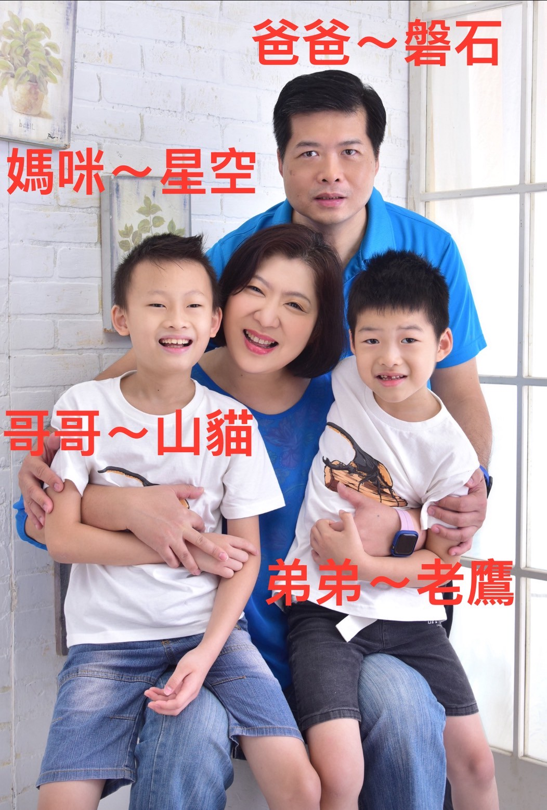

```
嗨大家好

我們是兩大兩小的家庭，兩個兒子，小一及小五，很榮幸加入蟻團及鹿團！

【關於我們的自然名】

爸爸是磐石 - 穩重，喜歡運動，在家裡扮演支柱的角色。

媽媽是星空 - 喜歡點點繁星的顏色，期待能散發溫柔溫暖的光芒！

大兒是南洋大兜蟲 - 天生的昆蟲學家，喜歡閱讀，也能信手拈來講解昆蟲知識！個性有點依賴，希望能獨立自主！

小兒是長戢大兜蟲，可愛調皮討喜的個性，喜歡跟著哥哥玩，期待能培養獨立自主的好品格！

【家庭的興趣與親子活動】

自然名很像露營時看到的夜空，伴隨著孩子的嬉鬧聲，在自然星空下，安穩自在放鬆！

期待可以在北七團跟大家一起上山下海喔！
```

```
報告：

我兒因自然名過長，擔心大家會太繞口，而爸爸也希望兒子能強壯些，所以該自然名啦！

大兒子：

原名—南洋大兜蟲—》山貓

（取自英文名字Samuel，教會年長者不會唸英文，直接叫他山貓）

小兒子：

原名長戢大兜蟲—》老鷹

（取自個子長的比同齡高，被老師叫一哥，一哥一哥念快一點變成eagle，eagle是老鷹的意思）

請大家多多指教
```

### 林家 - 遊戲家

 - `幸運草` - 育
 - `含羞草` - 育
 - `蒲公英` - 蜂一

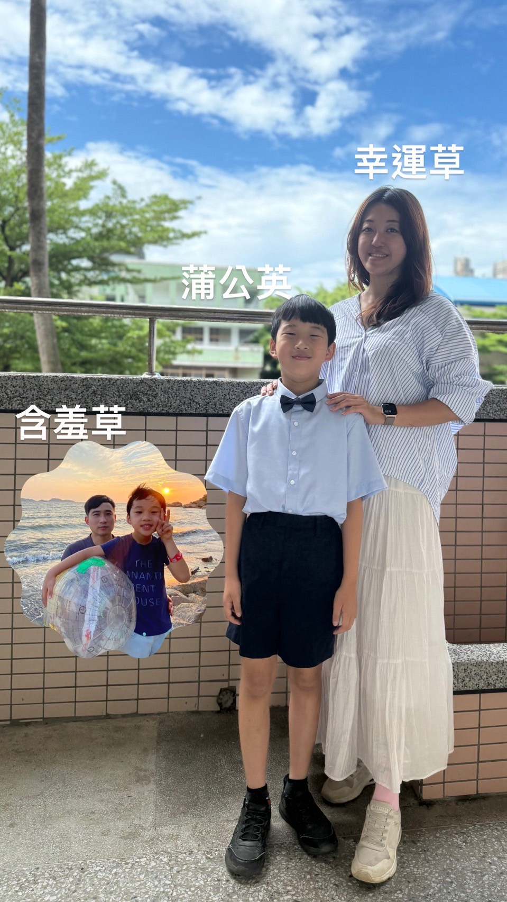

```
大家好，在遵循協會初衷更新了自然名，請參考新的自我介紹唷。

我們是「遊戲」家，爸爸是「含羞草」，媽媽是「幸運草」，Yoshi是「蒲公英」。取名「遊戲」是因為孩子本名的諧音加上自然名是透過自然生態衍生出的遊戲名稱。

▪︎本身的興趣專長？ 

媽媽：打籃球、騎單車、游泳、創投、商業數據分析、活動企劃。

▪︎孩子的個性與興趣（喜歡什麼、個性特點）

喜歡：看推理小說、玩數獨、踢足球、打籃球

個性：隨遇而安、與世無爭、土象星座。

▪︎平常最喜歡的親子活動

看電影、騎單車、玩水、桌遊。

▪︎想讓大家知道的小提醒或家庭小故事

我們是港台家庭，在2021年疫情期間離婚了，人力資源上主要是我自己一個人處理為主，爸爸遠端支援，我們會努力為荒野親子團付出與貢獻。期待未來跟大家有多互動唷。
```

### 林家 - 鳥事一堆

 - `藍腳鰹鳥` - 育
 - `五色鳥` - 育
 - `渡渡鳥` - 蟻一

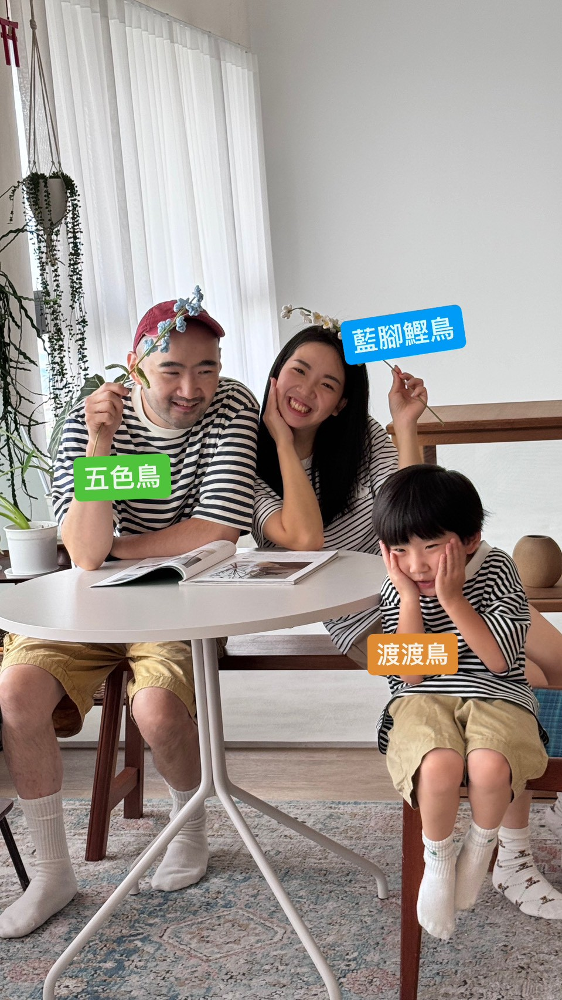

```
Hi 大家好 (大家好)(大家好)(大家好)

我們是五色鳥、藍腳鰹鳥和渡渡鳥

這一切要先從兒子說起

我們很期待加入北七團，知道沒那麼容易，但準備要做足，所以在親說會前就想了兩個自然名給兒子選

1.油桐花-因為爸爸和媽媽相識相戀在油桐花盛開的季節

（講著講著怎麼想吐🤣）

2.渡渡鳥-因為兒子肚子很大，渡渡鳥看起來肚子也很大

想當然現在看到自然名就知道兒子選「渡渡鳥」。

媽媽因為兒子選了鳥類

也想選同一種族

想著想著腦中浮現藍腳鰹鳥的炫腳舞，不得不說真的有夠可愛。

但在爸爸提醒諧音不好聽時，我好猶豫，最後決定為「藍腳鰹鳥」勇敢一次。

最後決定自然名的是爸爸

油桐花這個自然名直接落在爸爸身上，爸爸抗議他也想要同種；回想爸爸學生時期學廣告、學音樂、學美術，那集於一身的藝術家氣息，像藝術家的鳥類就直覺是「五色鳥」了，全家三票通過拍板定案。

非常期待有北七的新生活
```

### 林家 - 黃家

 - `海豚` - 育
 - `松鼠` - 育
 - `蛋黃` - 蜂二
 - `小鸚哥` - 蟻三

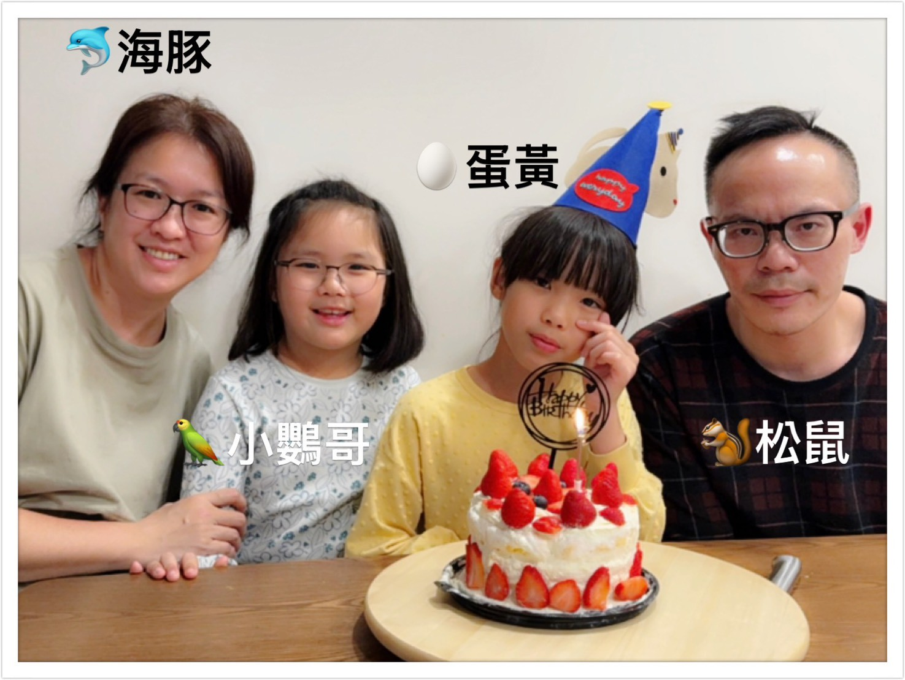

```
嗨大家好～

我們是一個兩大兩小的家庭，家中有兩位可愛的女兒，分別是小一和小三，非常開心可以加入蟻團和蜂團，一起展開快樂的自然探險生活！

【關於我們】

🐿️ 松鼠（爸爸）

松鼠是爸爸的幸運象徵！學生時期每次考試前，只要在路上看到松鼠，就能金榜題名、考上第一志願，因此「松鼠」成了他一生的吉祥物。現在松鼠專長於次世代通訊研究，像是6G、低軌衛星等技術的國際政策與產業動態他都熟門熟路。平常也喜歡研究3C產品、聽音樂，是家中的科技顧問和資訊雷達！

🐬 海豚（媽媽）

海豚是因為媽媽喜歡大海，在18歲那年第一次接觸潛水後，就愛上海豚喜歡牠們在海中悠游自在的模樣，也嚮往著那樣無拘無束的自由感。媽媽擅長烹飪美食，能用一鍋熱湯凝聚全家人的心。她的興趣包括旅行、露營、看星星、看海和發呆，總是帶著全家走入自然、感受寧靜的美好。

🥚 蛋黃（9歲，三年級）

「蛋黃」是班上同學給姊姊取的暱稱，只因為她姓黃，結果這個外號就一路陪她長大。她是位多才多藝的孩子，專長是打擊音樂和體操，身手矯健又節奏感十足。她還很愛做手工和美勞，是個充滿創意的小藝術家。每次露營，她總是最早衝出去交朋友，和妹妹除了吃飯睡覺才會在帳篷待著，活力滿滿。

🦜 小鸚哥（7歲，一年級）

小鸚哥的名字來自一次阿公送的驚喜。某次妹妹表現優異獲得阿公獎勵，選了養「小鸚哥」，結果其實是阿公在養，但這對小鸚哥後來一直生蛋，家裡越來越熱鬧、充滿笑聲，所以特別選這個名字，代表對阿公滿滿的愛。妹妹喜歡唱歌跳舞，個性開朗活潑，還喜歡畫畫、美食。姊妹對自然生態也充滿好奇，露營時常抓蚱蜢、青蛙蟾蜍、小魚小蝦….等觀察，是名副其實的自然小偵探！

【親子活動】

我們一家最喜歡的假日活動是在山林和海邊露營，，孩子們總是會自己找樂子、交新朋友，一邊認識昆蟲、一邊玩團康遊戲，笑聲此起彼落；我們則享受那份自在與療癒，感受親子共處的幸福時光。

我們的自然名，就像山林和海邊露營時相遇的朋友們，各有特色卻彼此陪伴、和諧共處～

期待能在北七團和大家一起上山下海、歡笑成長！🌲🌟
```

### 水家 - 星辰家

 - `金牛座` - 育
 - `水瓶座` - 育
 - `銀河` - 鹿二

### 水家 - 梅花鹿家

 - `唐棉` - 育
 - `梅花鹿` - 育
 - `向日葵` - 鹿二
 - `雲豹` - 蜂三

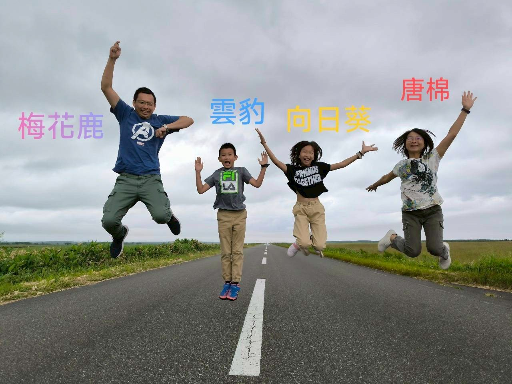

```
大家好，

我們是今年剛加入荒野的一家四口：梅花鹿、唐棉、向日葵、和獵豹

爸爸【梅花鹿】🦌

爸爸因為很喜歡北海道的大自然，所以自助旅行去北海道很多次。上次全家去北海道的時候，沿途遇到了很多美麗的野鹿，所以取自然名的時候，他腦海裡就浮現了梅花鹿。爸爸對不熟的人有些小害羞，但是為人真誠直率。 

媽媽【唐棉】🦠

唐棉是我最喜歡的植物之一。形狀像是顆綠色的泡泡球，泡泡球上有著許多軟毛，很可愛。爸爸在婚宴上，送了我一大束唐棉，是到現在想起來都是甜甜的回憶。喜歡大自然、熱愛藝術、樂於學習和嘗試新事物。

姊姊【向日葵】🌻

姊姊今年要升國一，個性較內向，較慢熟，是熟了之後十分樂於分享的孩子。她說她選這個自然名，是希望自己能夠像向日葵一樣，有著迎著光和保持希望的樂觀。她平常喜歡做美勞、唱歌和拉小提琴，是個勇於接受挑戰的孩子。

弟弟【雲豹】🐆

弟弟今年要升小五，個性活潑、人來瘋，很喜歡戶外運動。因為跑步很快，也想和雲豹跑得一樣快，也很喜歡雲豹身上的斑紋，所以選了這個自然名。不過脾氣來得也和雲豹一樣快…他平常喜歡打藍球、打棒球、彈鋼琴，喜歡探索地理和歷史的知識。

🔆周末是我們的家庭日，我們都會全家往大自然跑，舒展身心。我們喜歡一起去騎腳踏車、爬山、健行，因為媽媽熱愛藝文活動，全家也會一起去走讀城市、看戲、看表演、看展覽。全家也會一起玩烘焙。

🎈很開心能進荒野北七團認識大家，希望能和大家一起交流、學習和成長！
```

### 水家 - 田田圈家

 - `菜田` - 育
 - `海浪` - 育
 - `雷龍` - 蟻二

!!! note

    `田僑仔` 已改名爲 `雷龍`


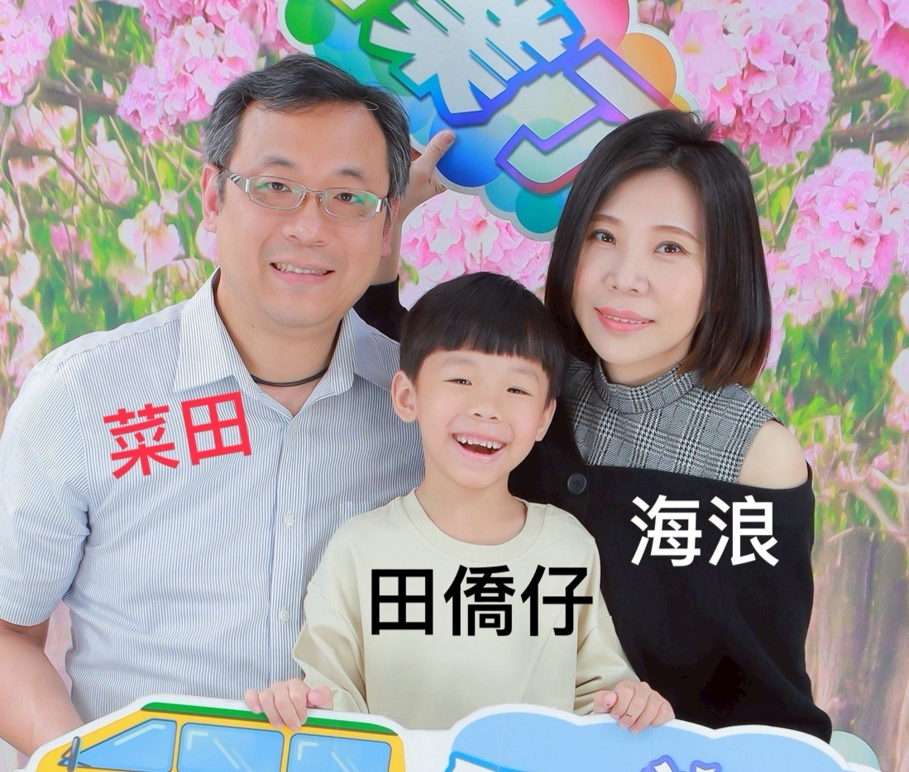

```
大家好，有點晚上來打招呼

我們家是今年新進家庭，希望臉盲的我可以記起來大家的自然名！！

▪︎家庭自然名的由來？（為什麼取這個自然名？)

爸爸：菜田

這是高中時因為外貌與骨瘦如材，同學覺得和當時的「菜田飄香麵」的主角很像，加上我的姓氏有個田字，就一路沿用到現在，也還好這也可以當自然名，不然還真想不出來。（現在的外觀是那時候的兩倍，所以看到我可能無法想像我當時有多瘦，給個比例做參考，當時181/24腰）

兒子：田僑仔

當然就是因為老爸姓田，大家從小就要叫他田僑仔，所以他的自然名也就沿用了大家的習慣稱呼。

媽媽：英文是nami,就取名海浪

她是一個比我更常加班的人，做平面設計的雙子媽媽。

看來我們的自然名其實都是別人幫取的耶⋯⋯😂

▪︎家庭成員？

我們家很熱鬧，一個屋簷下有我、太座、太座大妹、她的兒子兩位和我家的田僑仔，這也是為何我們出門必須開菜田號老海獅八人座，因為一般車坐不下呀⋯

▪︎本身的興趣專長？

菜田我從小參加童軍到現在，真要講興趣，大概就是喜歡露營接近大自然，然後在家把陽台搞成像森林，真有空就上合歡山拍拍星空日出。

或許戶外活動和拍照，勉強可以說是專長。

▪︎孩子的個性與興趣（喜歡什麼、個性特點）

田僑仔他屬於害羞慢熟，會先看看發生什麼，再來決定怎麼回應，可當他認定是朋友的時候，也是可以玩在一起的，所以被他纏上的時候請多點耐心唷😎

▪︎平常最喜歡的親子活動

因為工作忙碌，其實放假沒加班的時候多半懶在家，也因為這樣覺得不行，所以才帶他來參加荒野，幾次公司的綠委活動，像是植樹淨灘，看起來他都蠻有興趣的，所以我們喜歡的活動定義在這類動手做的事情。

▪︎想讓大家知道的小提醒或家庭小故事

我們很希望藉由這樣的團體、活動，讓自己成長，也因為我比較晚才生，希望他能夠藉由參加這樣的團隊，早點讓自己更獨立，更能適應未來真實的社會，如果我們有哪邊做的不好，也請大家私下跟我們直說，我們會想辦法改善。

以上，蠻平淡的介紹，希望大家可以接受🤣🤣🤣
```

```
報告：田僑仔因為不是自然名，歷經了氣體、植物、昆蟲、動物….最後改名成了 「雷龍」，希望之後他可以長得強壯高大但個性溫卻堅強，不受小事影響自己。

現實上「雷龍」個子瘦小，屬於慢熟型，請大家多多關照。
```

### 水家 - 艾迪生家

 - `夏夜` - 育
 - `革龜` - 育
 - `歐若菈` - 蟻三
 - `星龜` - 蟻二

!!! note

    `極光` 已改名爲 `歐若菈`


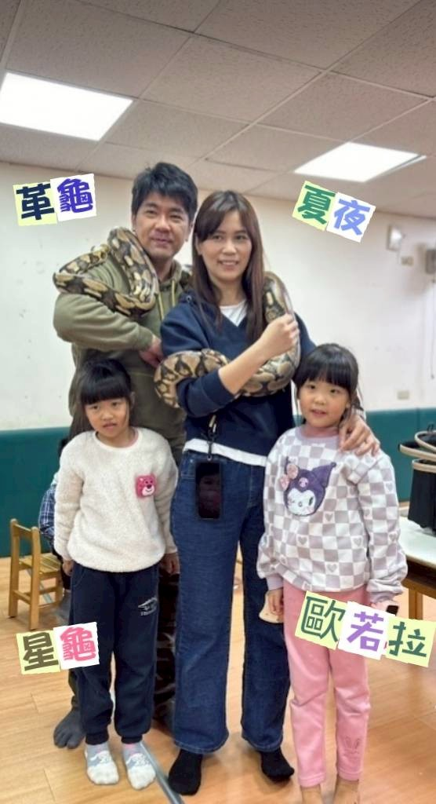

```
嗨~大家

我是夏夜，家庭組成如下:

爸爸-革龜

想當然，會取龜名自然是個烏龜狂熱者

至於為何是革龜中選，爸爸回覆”革龜是目前世界上最大的海龜，我想載著家人一起出發去探險”

爸爸的專長是美術，學生時代玩過社團

公主們還沒降臨以前，喜歡潛水

媽媽-夏夜

我覺得自己像夏天的夜晚，

不是白天炙熱的陽光，

但也不是深夜的靜默，

涼涼的風、悠閒、舒服，適合吃個透心涼的冰棒或西瓜

專長….目前沒想到，不過對於事物都有心學習，屬於默默耕耘型

目前還是潛水小菜菜(因為考到照沒多久公主們就來報到了)

7歲姊姊-極光

近期剛好有去科教館的極光展，她印象深刻，也覺得很美，所以取名

姊姊有遺傳爸爸的美術天份，喜歡畫畫作手作

到新環境會需要一點時間觀察熟悉

久了就會露出里長伯個性

邀約朋友、照顧他人、管理秩序、都可以找她幫忙

6歲妹妹-星龜

我都說妹妹是爸爸的小腦粉，爸爸取龜名，她說她也要~所以幫她取了可愛的星龜

妹妹也是新環境會觀察一下

對於自覺有把握的事情會勇於嘗試

新事物需要稍微鼓勵

肢體協調滿不錯的

十足的理工腦

我們假日基本上都會安排活動

在家待不住

喜歡露營，喜歡海邊

一家四口出門走走，參加戶外活動

給小孩滿滿回憶的童年

期望小孩獨立，看著爸媽的背影，長成自己的模樣
```

### 水家 - 麥勾家

 - `開心果` - 育
 - `豐年蝦` - 育
 - `藍閃蝶` - 蟻二

!!! note

    `野貓軍團` 已改名爲 `豐年蝦`


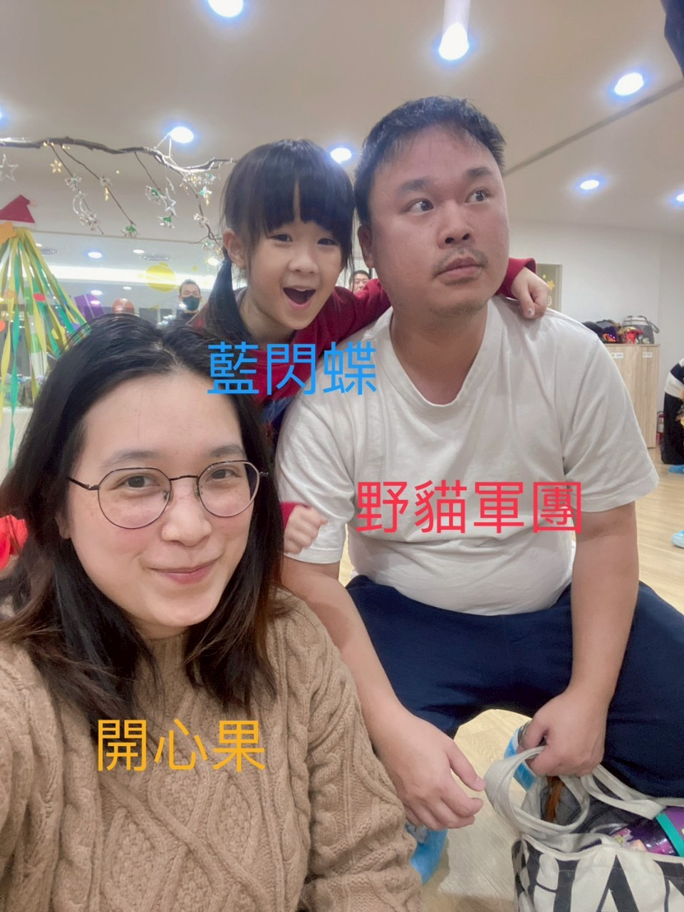

```
大家好～！我們是今年加入蟻團的麥勾家，爸爸-野貓軍團、媽媽-開心果、6歲小妹-藍閃蝶，一家三口，家住三峽，歡迎鄰居來認親。

關於我們的自然名：

爸爸-野貓軍團

野貓軍團是爸爸最愛的繪本了！每次看都哈哈大笑，胖胖圓圓的野貓軍團，總會天真勇敢的犯蠢，但犯了錯從不逃避，開心收拾！

媽媽-開心果

最喜歡開心果口味的蛋糕，最喜歡開心果奶奶的綠色，最喜歡開心果三個字看起來很開心！

六歲小妹-藍閃蝶

我不確定她為什麼想叫藍閃蝶🤣

大概經歷四個名子已經有人用了之後，第五個蹦出的自然名，

我想⋯大概就是一種緣分吧🤣
```
### 風家 - 古道家

 - `銀葉板根` - 育
 - `黃藤` - 育
 - `青楓` - 鹿二

### 風家 - 四海為家

 - `青苔` - 育
 - `朽木` - 育
 - `鵝卵石` - 蟻三

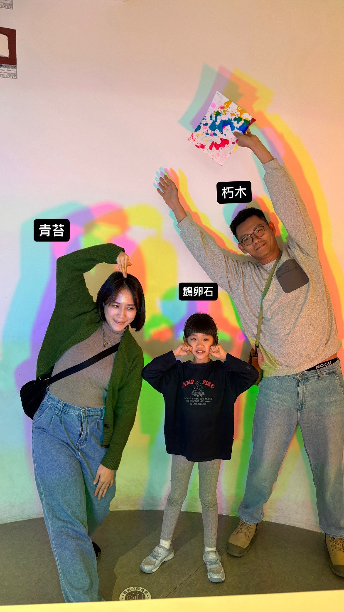

```text
嗨大家好(emoji)

我們是兩大一小的家庭，女兒今年升小二，加入蟻團。

【關於我們的自然名】

爸爸是朽木 - 外型黑黑瘦瘦長長，他很喜歡朽木看似雖然無用，但若擺放在適合的位子，卻能展現出獨特的意境。

媽媽是青苔 - 我喜歡青苔這種抹茶綠的顏色，也很喜歡青苔雖然不起眼，但總能在最適合自己的環境長出一片翠綠。

女兒是鵝卵石 - 小小圓圓硬硬的，也有點像她的脾氣，雖然硬但好好溝通後卻又很圓滑。她是個大寫的I人，在團體裡總是比其他小孩更慢熟，不太擅長熱情踴躍的參與和表達，個性謹慎保守但內心卻又十分願意付出和幫忙。

【家庭的興趣與親子活動】

自然名很像庭園造景的一家人，我們最愛的活動就是往海邊跑。喜歡潛水、玩SUP，也喜歡在潮間帶觀察小生物。

不能玩水的日子我們偶爾露營，也喜歡在家畫畫做勞作。在面對小孩時，爸爸負責動態活動媽媽負責靜態活動，母女都算是有一雙巧手，而爸爸最大的才華就是跟誰都能聊天。

期待可以在北七團跟大家一起上山下海喔！
```

### 風家 - 忍龜家

 - `雪絨花` - 育
 - `忍者龜` - 育
 - `紅豆` - 鹿一
 - `綠豆` - 鹿一

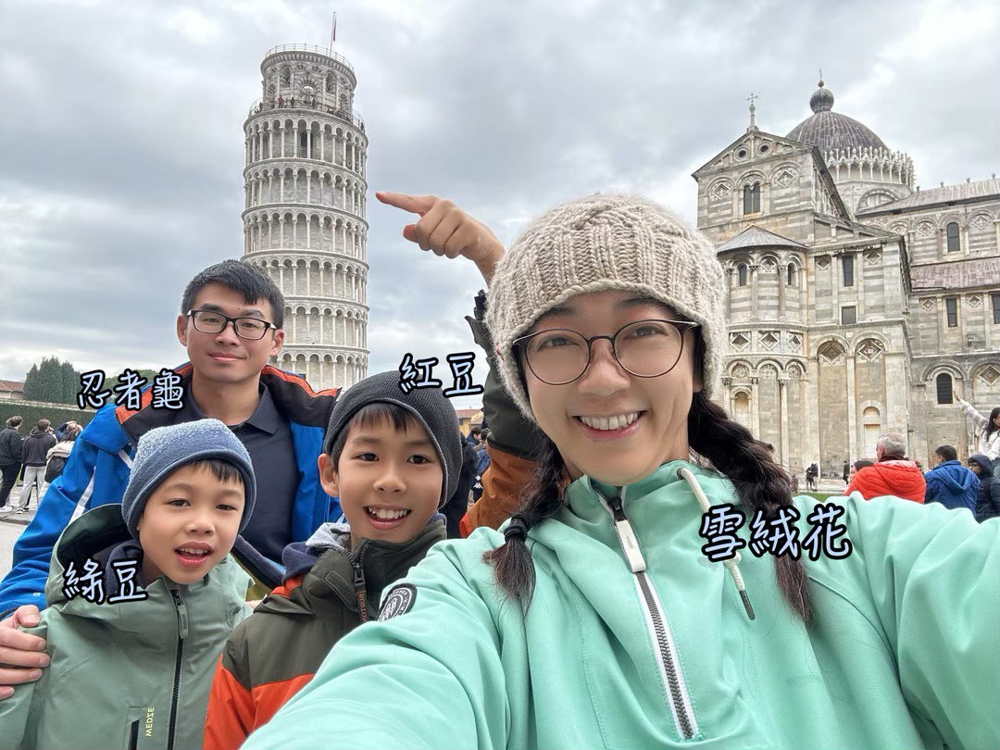

```
我們是一家四口

✅爸爸大學時代起黑黑大大的膠框眼鏡加上笑起來大大的嘴角

被同學取了個有點年代感的卡通綽號～忍者龜

✅兩個12歲兒子是一對雙胞胎

當初只想說有一個孩子胎名叫豆豆

想不到一做檢查『太太～肚子裡有兩個心跳喔』

豆豆就變成紅豆綠豆啦

✅媽媽的自然名是雪絨花，是想要紀念過去七年在奧地利旅居生活的美好回憶

雪絨花Edelweiss是奧地利的國花，又叫做小白花，生長在阿爾卑斯山區的高山花卉。

➌本身的興趣專長？

✅爸爸媽媽是大學時因為打排球相識，

不過多年過去，運動習慣也大大改變

忍者龜目前是網球愛好者

專長他想了很久耶～『開車技術沉穩安全算嗎？』他說

（嗯～還是先不勉強爸爸好了）

✅雪絨花的興趣是整理奧地利的在地旅遊資訊還有熱情的分享給大家。

專長有點說不準，畢竟是當了12年的家庭主婦，實在心虛，不過媽媽為人友善真誠，很容易跟大家打成一片拉近距離。是被家中三男認證過他們做不到的優勢。（簡單來講就說大家口中的厚臉皮🤣🤣🤣）

➍孩子的個性與興趣（喜歡什麼、個性特點）

雖然是同時間生出來的一胎雙胞，但雙豆個性是南轅北轍大大的不同。

✅紅豆活潑外向，能言善道。喜歡運動

最近開始迷上樂樂棒球

會很認真的學習自己不熟悉的事物。

✅綠豆個性低調安靜，屬於會先待在一旁默默觀察的類型。

不需要在意的事情不會花心思多想多做，

但如果是自己認定的事物，會一心一意的勇往直前。

目前最熱愛的是劍道，還有探索歷史知識（對於歐洲史還有二戰非常著迷）

➎平常最喜歡的親子活動

忍者龜跟紅豆會一起出門打網球

綠豆是個會想嘗試煮東西的孩子。

之前旅居維也納時的假日夏日很常出門葡萄田健行還有森林公園野餐，冬天衝奧地利其他地方滑雪。

回來台灣這一年的變動跟適應，各種忙亂讓我們一直抓不到日常規律的生活節奏

也比較少安排假日出遊計畫

這次有機會加入北七團的行列

希望能跟大家多多交流各式各樣的生活資訊
```

### 風家 - 茶米家

 - `茶米` - 育
 - `奇異果` - 育
 - `山羊` - 鹿一
 - `獵豹` - 蜂三

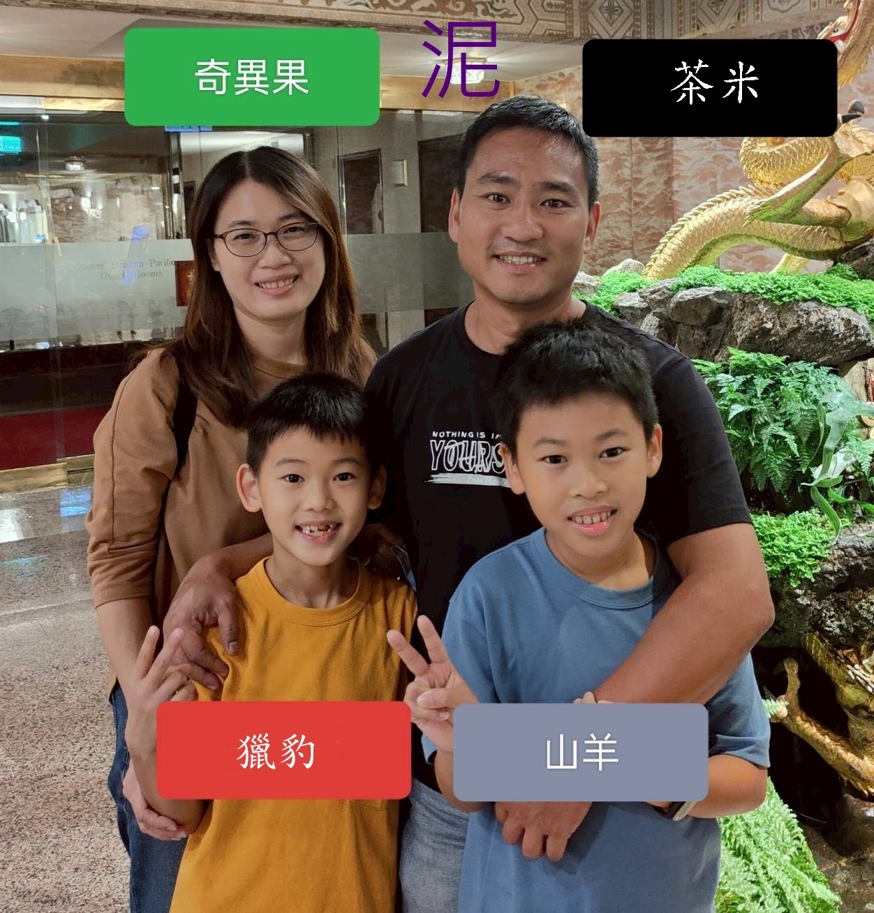

```
大家好！我修改一下名字

原亞達改成茶米

我是茶米，是剛加入的新成員，已迫不及待想和大家一起在荒野中闖蕩啦～

向大家介紹一下家中成員，爸爸-茶米，11歲的大兒子-山羊，9歲的小兒子-跳跳虎，媽媽-奇異果。

小兒子-跳跳虎

特別熱衷於社交，無論是家裡的好事還是壞事，他都樂於和大家分享，有時會讓人頭疼，就說家醜不可外揚，但他對幫助他人充滿熱情。此次的自然名，他說他想像老虎一樣兇猛又可愛，我們說他總是精力充沛，所以他是跳跳虎。

大兒子-山羊

是一個好脾氣的人，喜歡傻笑，熱心助人，處事謹慎。但是一遇到弟弟就兵敗如山倒，期許他在接下來的歷練，遇到更多的人事物後，能夠有所成長。自然名的由來，就因為他說他住在山上，名字裡還帶著一個“暘”字。所以他自然名叫做：山羊。

媽媽-奇異果

緣於以前入住學校宿舍時，帶了很多奇異果在宿舍內吃，被新同學取名奇異果。

在加入荒野之前，孩子平時有參加跆拳道課程和童軍活動。因為自己喜愛手作課程，常常找孩子們幫忙手作課程前期準備。

加入荒野後，我們可能會更加忙碌，但只要全家在一起，每分每秒都是幸福時光。

至於為什麼我叫茶米，因為我的英文名子是是DAVID，我之前的員工都叫我茶米（台語），想想還是這個比較習慣。
```

### 風家 - 雨林家

 - `質子極光` - 育
 - `秋山雨林` - 育
 - `紅色精靈` - 鹿一
 - `土撥鼠` - 蟻三

!!! note

    `極光少女` 已改名爲 `質子極光`

    `哆啦A夢` 已改名爲 `土撥鼠`


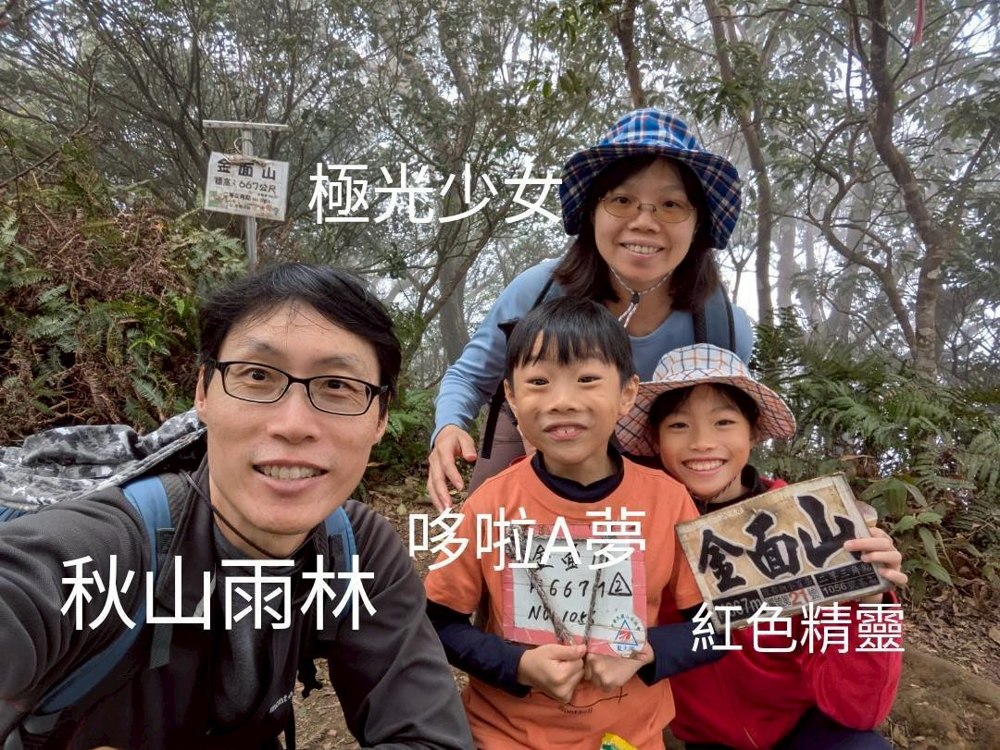

```
嗨大家好

我們是兩大兩小的家庭，弟弟小一，姊姊小五，很高興加入蟻團及鹿團！和大家一起探索大自然。

【關於我們的自然名 個性與興趣】

爸爸 秋山雨林  是從原本的名字拆解出來的 爸爸興趣是生態攝影 自然觀察和聽音樂。

媽媽 極光少女 剛好也是因為前幾天去看天文館的遇見歐若拉 極光展 決定開啟追極光之旅 極光是一種美麗的天象 也是幸福的象徵 所以請大家容許我把時間往前調30年 那麼我就可以是極光少女了... 媽媽興趣是上山下海和閱讀 夢想帶全家人環遊世界 。

姊姊(小五) 紅色精靈 喜歡看閃電 覺得這個名字很可愛 紅色精靈是大氣中最壯觀且少見的現象，展現了自然的神秘與壯麗，姊姊個性溫和好相處(對弟弟除外>.<)喜歡跑步，畫畫，閱讀，彈琴，手做DIY。

弟弟(小一)哆啦A夢 很喜歡哆啦A夢 是個哆啦A夢迷，個性害羞內向，天生反骨，堅持且固執，有點頑皮，興趣是畫畫，拆解車子，玩桌遊，閱讀。

【喜歡的親子活動】

假日好天氣會安排戶外活動，走步道或爬郊山，下雨天則在家玩桌遊。

最後期待和大家一起在自然中冒險，一起共好，共同成長！
```

### 風家 - 黑潮家

 - `紫錐花` - 育
 - `黑潮` - 育
 - `紅熊貓` - 鹿一
 - `始祖鳥` - 蟻三
 - `比目魚` - 蟻一


